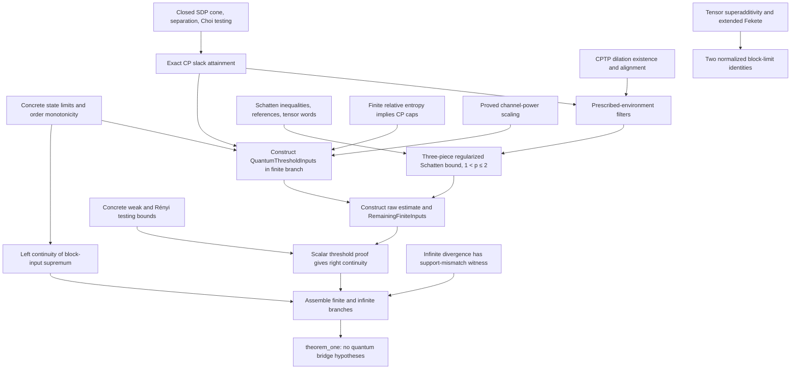

# Proof navigation

This repository provides a local theorem index, searchable descriptions, and a
dependency overview inspired by Prove2Me. These files do not require a Prove2Me
account and have not been uploaded to Formalpedia.

## Search and reproduce

Search the committed index with Python 3.9 or newer; Lean is not needed for queries:

```sh
./search-lemmas.sh 'slack attainment'
./search-lemmas.sh 'singular states'
./search-lemmas.sh 'near-one restriction'
./search-lemmas.sh --deps QuantumChannelContinuity.theorem_one
./search-lemmas.sh --uses QuantumChannelContinuity.hockeySlackAttainment_of_nonneg
./search-lemmas.sh --closure QuantumChannelContinuity.theorem_one --json
```

Use `--json` for machine-readable results and `--limit 20` for more matches.
To rebuild the completed solution and regenerate the exact index:

```sh
./run-lake.sh exe cache get
python3 scripts/proof-index.py --regenerate
```

The first command is only needed to prepare dependency caches. Regeneration
uses the pinned Lean toolchain and libraries and verifies that proof sources do
not change during extraction. It also verifies every curated declaration exists.

## Exact graph and curated overview

[proof-index.json](proof-index.json) is extracted by
[ExportProofIndex.lean](../scripts/ExportProofIndex.lean) from Lean's elaborated
environment after importing the completed solution, `ChannelRenyiContinuity`.
It indexes declarations defined in the project's `QuantumChannelContinuity.*`
and `ChannelContinuity.*` modules, including loaded historical interfaces and
private/generated auxiliaries. Challenge files are not imported. This scope is
the solution's import closure, rather than every file in the repository.

For each declaration, `typeDeps` lists the distinct constants in its stored
type, and `proofDeps` lists constants in its stored theorem proof or definition
body, including annotations within that body. These are actual expression
references, extracted with `Expr.foldConsts`, rather than textual mentions or
module imports. Constructor, inductive, and recursor nodes have no stored proof
body. Direct references outside the project (mathlib, Lean-Quantum, and Lean)
remain in the edge lists without a project node.

`targetReachability` records the transitive closure of both edge kinds for each
of the three checked targets. Source module, relative file, one-based line where
Lean provides one, pretty-printed declaration type, and existing docstrings are retained. Null
locations are explicit. Source and extractor hashes establish which checkout
was indexed. Extraction is a navigation tool; Comparator and Nanoda remain the
proof checks.

[lemma-descriptions.json](lemma-descriptions.json) adds curated descriptions and
search tags for major reusable statements. The index labels these separately
from existing Lean docstrings. Descriptions are explanatory metadata, not a
replacement for the formal statement.

The following **curated overview** groups many exact proof steps. Arrows mean
“supplies an ingredient,” not one direct declaration edge. Use the index above
to inspect exact edges, including generated intermediate proofs.



The block-limit identities separately identify the supremum-based formal
definitions with the manuscript's limit-based regularization. They are checked
targets in their own right; the diagram does not assert that the main proof
directly invokes those two identities.

## Where the earlier hypotheses are discharged

The earlier conditional declarations remain as reusable interfaces. Their
existence does not make the final result conditional. The final path constructs
their records from proved quantum facts:

| Earlier input | Completed supplier |
| --- | --- |
| State order-one limits, including singular states | `stateRenyi_tendsto_one` |
| Pointwise order monotonicity on both sides | `stateRenyi_monotoneOn_left/right`, then `inputRenyi_monotoneOn_left/right` |
| Exact CP upper slack | `hockeySlackAttainment_of_nonneg`, specialized by `hockeySlackAttainment_of_one_le` |
| Filter in the prescribed environment | `hockeySlackAttainment_of_nonneg` discharges the slack premise of `_of_slack_attainment`; `fixed_dilation_hockey_filter` is the unconditional wrapper |
| Actual finite Stinespring dilation | `cptp_has_nontrivial_dilation` |
| Uniform block CP cap | `regularizedRelative_ne_top_iff_cp_domination` and `finite_cap_of_cp_domination` |
| Block power scaling | `regularizedRenyi_power_scaling` |
| Raw regularized Schatten field | `QuantumThresholdInputs.raw_schatten`, then `QuantumThresholdInputs.toRemaining` |
| Scalar testing fields | `RemainingFiniteInputs.analytic` supplies the proved channel testing bounds |

`quantumThresholdInputs_of_mono` constructs the finite-case record. The only
finiteness condition in that construction is established by the finite branch
of the final case split. `theorem_one_of_input_order` combines this branch with
`theorem_one_of_regularizedRelative_top`; `theorem_one` then supplies the two
remaining monotonicity arguments. It takes only the actual channel pair and
finite-dimensional nonzero-space instances.

## Paper correspondence and scope

[paper-mapping.json](paper-mapping.json) gives paper equation/theorem locators,
formal declaration names, and conditions. In particular:

| Paper item | Formal result |
| --- | --- |
| Theorem 1, equation (1.1) | `QuantumChannelContinuity.theorem_one` |
| Regularization, equation (1.5) | `blockRenyi_tendsto_regularized` and `blockRelative_tendsto_regularized` |
| Lemma 2, equation (2.5) | `fixed_dilation_hockey_filter` |
| Lemma 3, equation (2.6) | `regularizedRenyi_dilation_bound` and its exponential form, **restricted to 1 < p ≤ 2** |

The near-one restriction suffices for the proof of Theorem 1. It does not
claim the paper's full decomposition lemma for every order above one. Later
operational corollaries are outside this formalization's stated scope.
